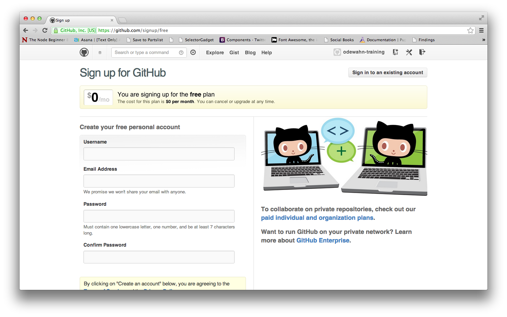
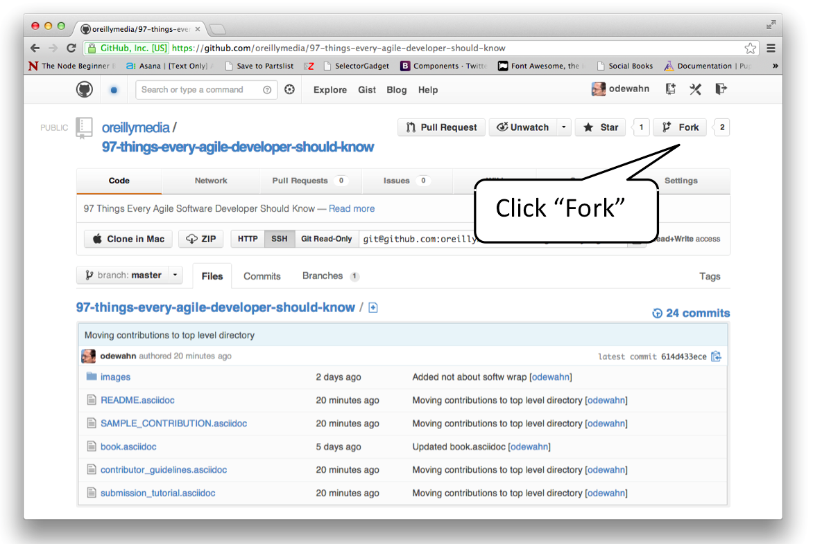
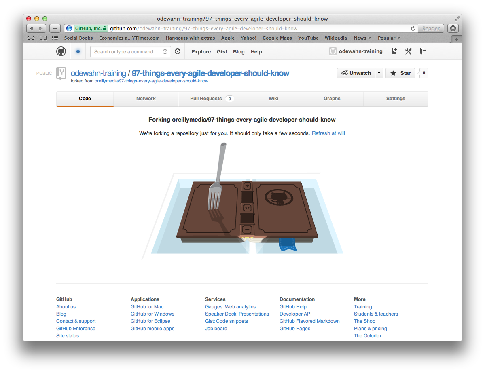
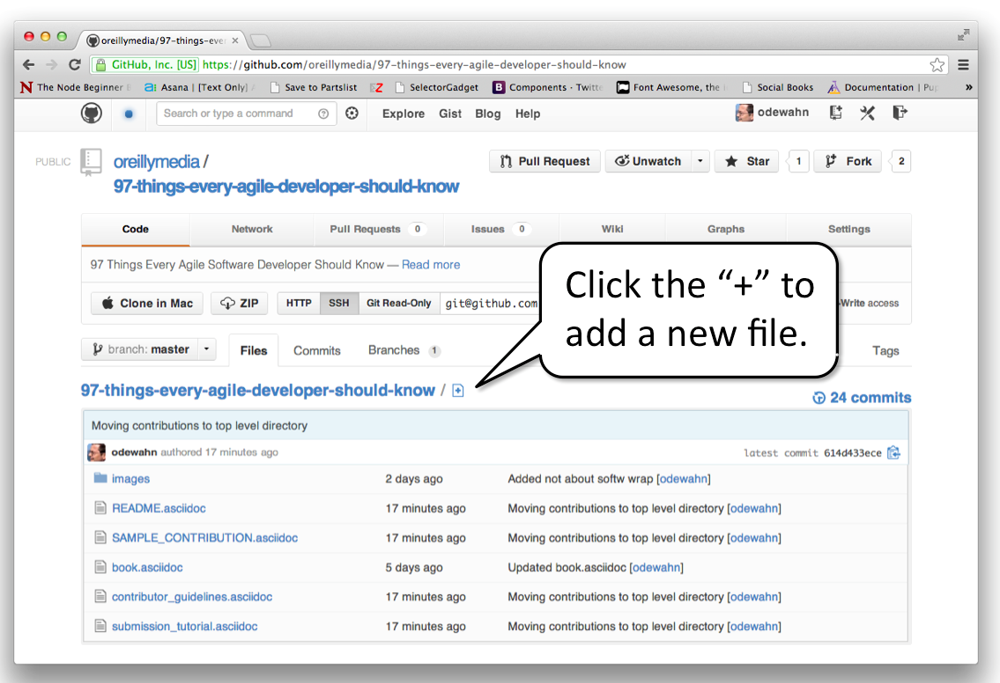
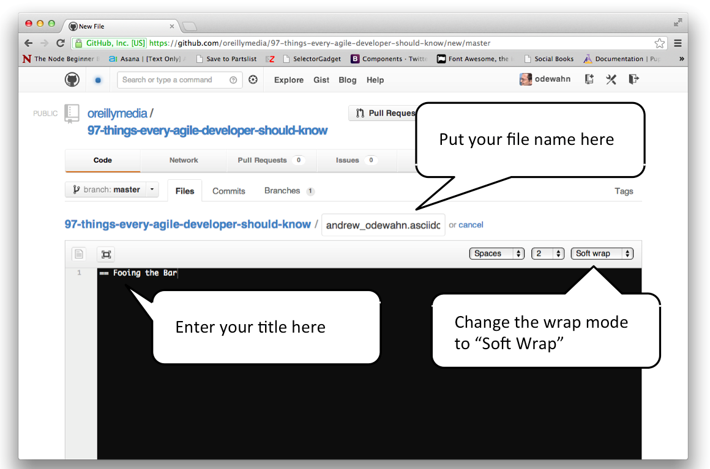
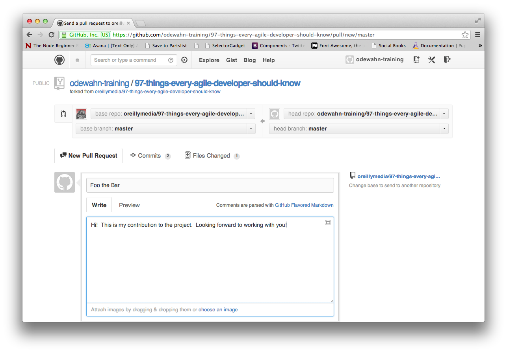

# 97 Things Every Agile Developer Should Know

## Preface {#\_preface}

Agile development is the greatest thing ever.

## Beware of Agile Zealots {#\_beware_of_agile_zealots}

You know them when you see them coming... Crazy eyes, intensity oozing out of
every pore, they are on a mission to convert the uninitiated, they have found
religion. No, I'm not talking about that, I'm talking about AGILE zealots. These
people are excited and they want everyone to know it! Now, to be fair, they have
great intentions, but have lost the connection to the area in frontal lobe of
their brain that is responsible for rational reasoning.

One of my former teammates became a such a zealot and as far as I know may still
be one today. I can remember all the conversations like it was yesterday.

It was 2005, my teammate had just come back from training on Scrum, which was
still in the early adoption phase of maturity. They had learned the basics of
Scrum, and what stood out to this person was the concept of story cards. You
would have thought this person just discovered the meaning of life. This person
was passionate and was excited to implement this new approach. I wanted to
harness all of this person's energy and help them find success and ultimately
evolve the organization. This person had a Utopian and short sided idea of how
Scrum should be implemented and was not very open to ideas that varied from
their vision.

Over the next weeks we had conversations about how to implement these ideas in
our organization. Most of the conversation focused on tools, the rest on what
would later be known as agile scaling. Our organization had well defined
lifecycle processes and had automated it in our workflow management tools. Being
the administrator of this tool, I wrapped my mind around it and determined that
it would be quite feasible to automated the Scrum engine and add user stories
into the tooling. In fact, by embedding it in the tooling that the organization
had embraced, I thought this would accelerate the adoption and ease the
resistance to change that would be encountered. The mere mention of tools to
implement Scrum was tantamount to heresy. This person insisted that index cards
were the ONLY way to create user stories, period, end of discussion. They
referred to the first value stated in the Agile Manifesto, Individuals and
Interactions over Processes and Tools.

This person made the same mistake that many evangelists make, strict
interpretation. When it comes to agile, strict interpretation directly conflicts
with the very principles and spirit of the Agile Manifesto itself. The whole
point is that agile is a change in the way organizations operate to deliver
value to their customers faster, but does not profess a prescriptive
methodology. In the same way, Scrum is a framework for agile development, but
does not state the way in which it should be implemented. In fact, two of the
values of Scrum are being open to discussing impediments to success and to
respect each other and help each other become worthy of respect. How was
shutting me down being open or respectful?

As we adopt Scrum or other agile approaches we cannot forget the reason we are
embracing a new approach. Every organization has different needs and will likely
implement their version of agile differently. As Scrum has matured and the need
for scaling in a large, or even medium sized organizations, it has become very
apparent that tools must be employed to effectively scale agile and to provide
the transparency that truly enables and accelerates the adoption of agile
values.

So watch for such zealots and commend them on their passion, but remind them
that prescribing agile with a strict interpretation goes against the very
philosophy that they are proselytizing.

About the Author

Name

: Matt Holitza

Biography

:

## Don't Write Smart Code {#\_don_8217_t_write_smart_code}

Throughout my career in software industry, I got to see ideas that seemed clever
at the time turn out not as clever in hindsight. This became such a pattern that
I eventually crystallized it as my _dumb code good, smart code bad_ law. Note
that by saying _dumb code_, I don't mean _bag of hammers_ dumb. Just ordinary,
by the book, consistent, easy to read, following the good practices, as simple
as possible code.

Software developers like to think of themselves as smart (actually smarter than
most people). Ever since all the sorting algorithms have been invented and CSc
departments banned any new submissions, a future software developer cannot go
through university without writing a compiler or three. And the new languages
they invent need to be quirky and different (Scala anyone?).

When software developers join companies, they carry over their taste for indie
code practices to the production code they start writing. Let me count the ways
why their code ends up causing headache to everybody:

1.  **Using code to impress.** Developers sometimes feel they need to prove
    themselves, and code seems to be a great way to show _them_ what they are
    capable of. This means passing every opportunity to use the simplest
    solution that does the job.

2.  **Local solution for a global problem.** Without control over the project as
    a whole, developers tend to try to fix a problem locally. Local solutions
    only address that one instance, create inconsistencies, and will be a burden
    at some point in the future when the fix of the global problem is attempted.

3.  **Nobody understands your code.** Clever code is by definition unusual,
    needs some time to digest, and is often incomprehensible to everybody
    including the author after a month (at most). Since code lives forever, this
    particular corner will be avoided at all costs by poor developers assigned
    to maintaining it, it will be worked around and eventually yanked in
    frustration.

4.  **Smart code is hard to optimize.** Straightforward code responds well to
    automated optimization and refactoring. Compilers are more likely to
    automatically speed up code that does nothing strange or crazy. As said in
    (2), it is easy to make a sweep through the entire project if all the code
    that needs to be visited is easy to understand.

5.  **Smart code is buggy.** Seinfeld observed that 'sometimes the road less
    traveled is less traveled for a reason'. Smart code is attempting something
    novel and unusual, and as such there are always some rough edges to smooth
    out, necessitating frequent revisions. Novel and unusual algorithms and
    approaches typically look great during a coffee-fueled all-nighter, but
    often require a lot of tuning to work well in production.

6.  **Smart code gains are ephemeral.** Smart code is often smarter than it
    needs to be because there was a problem with some browser or OS version.
    Chances are that code will outlive its purpose soon after the next
    browser/OS update. I am not saying you should never write this kind of code
    (search all the occurrences of IE-related comments in Dojo), but it is
    prudent to clearly mark it and make it easily defeatable when it outlives
    its purpose.

Lest this story sounds as a criticism of _them_ whereas _we_ are different, I am
writing it from a position of somebody who has been there, done that and bought
the T-shirt. I am trying to convey a hard-earned realization caused by writing
smart code, feeling smug about it, forgetting how it works, hitting a problem
after problem later and eventually yanking it with a sigh of relief when the new
version of a library or browser made it unnecessary. The reason more seasoned
developers are less likely to do it is because they had enough time to see the
entire cycle, not just the initial buzz that smart code brings. In situations
where writing smart code is inevitable, realize that you are fixing a temporary
problem, cordon off the code, mark it clearly and keep an eye on the earliest
opportunity to dump it without mercy (which requires that you avoid becoming
personally attached to that code, otherwise you will feel like you put your
favorite puppy to sleep).

You could say that smart code is a drug - it brings euphoria when you write it,
but you pay the dire price down the road. Therefore: don't write smart code --
for your well being and for the well being of the project.

About the Author

Name

: Dejan Glozic

Biography

:

## Lifelong Learning {#\_lifelong_learning}

You think you're done learning, as you've finished school or university or
worked in the field for 20 years? No way. I can assure you, the journey has just
begun.

Most people think, that software development is just about writing code, but we
know better. It is much more than that. Acquiring enough knowledge about the
domain, the use-cases and problems at hand, is crucial for writing that code.
After all code is just executable knowledge, automating things that you would do
manually otherwise.

In the end, the code is not what counts. Imagine starting the same project you
just did with a blank slate but with everything you've learned in your head,
every dead end hit, every bug fixed, every night spent. How much time would you
need now to solve the same challenge again? Half? A third? Even less? Much of
the time we spend on a software project is used to learn how to solve a problem
or get enough insight to continue. Dan North even makes this explicit - he calls
this approach \"deliberate discovery\". Know what you don't know but need and do
something about it. And make learning an explicit part of your daily development
process.

I think being conscious about learning new things, embracing new insights and
epiphanies is important for having a great work life. I for myself feel that
every day, that I didn't learn something new is a lost day. So regardless if it
is something about the domain, an interesting pattern, computer science
algorithms, a new tidbit about a programming language, new libraries or
frameworks or just a new insight on how people work (that's the most challenging
one), all of these contribute to having a great day. If you make learning an
explicit part of your daily work you are much more aware of it and it doesn't
become just an implicit side-effect. That will also make it much easier to
convey the information to others. After all you just gained the knowledge, so it
is very fresh on your mind how you did that. Telling someone else is just
re-living your current learning. No need to dig out the information from the
depths of your unconscious implicit memory where it is encoded in your
experiences.

It doesn't stop there, learning for oneself is helpful but sharing is even more
rewarding. So make it a habit to tweet, write blog posts, answer on the
Stackoverflows about the small new insights you've gained. From there you can
take one step at a time and start to contribute articles to other sites,
magazines or even look into writing a book.

There really cool things about sharing what you've learned. First of all it is
very rewarding to have other people read and like your musings. Even better if
your publications are really helpful and allow them to take shortcuts in finding
the relevant information. But the best thing is, that while writing you revisit
the topic, are forced to take an outsiders perspective and think more deeply
about it. Writing about something you don't know is also a great way of getting
started with learning about it.

If you are not so comfortable writing or think other ways are more effective -
talking about your experience is an even better way to get your message across.
Again, start small, easiest is to just record a screencast, put it online and
share it. Screencasts are a cost and time effective way of creating a \"live\"
presentation, and much better if you want to show code.

You can start presenting with your friends, the colleagues in your team or local
user-groups. When you are more comfortable, don't hesitate to reach out to other
events or conferences. Most of them are happy to accept new speakers with
interesting topics.

You can find a great collection of patterns on becoming a better developer in
the \"Apprenticeship Patterns\" O'Reilly book by Dave Hoover and Adewale
Oshineye and Andy Hunt: \"Refactor your wetware\".

About the Author

Name

: Michael Hunger

Biography

:

## How to Create Real and Lasting Change {#\_how_to_create_real_and_lasting_change}

As a developer you're probably well aware that there's a better way to do many
things in your organization. Because you are on the front lines of product
development you acutely feel the effects of the dysfunction in other departments
and undoubtedly see things others don't. This is why most Agile transformations
I've seen start with agitation from the people actually building the product.

If we think of an organizations as an organism the pain the development team
feels---and the subsequent loss of business performance the organization
notices---is the proverbial thorn in the paw that finally creates an opening for
an organization to ask for help and make a change. The challenge you face
however once you wade into a change of process is that what you're up to defies
logic, doesn't move in a linear path, and is more about a shift of culture than
it is about any specific practice you may want to change.

The Thigh Bone's Connected to the Leg Bone Not only are your products complex
with each technical decision having far-reaching impacts on scalability,
stability, extensibility, and more. But your organization is complex as well.
And the most important algorithms that govern the behavior of our businesses are
poorly understood, poorly documented, and so mysterious that even the inmates
running the asylum often don't know what to do to make real change.

For instance, one of the most common anti-patterns I see in organization is the
heroin-like dependency on big up-front requirements definition and multiple
layers of approval for these requirements.

I frequently work with teams to install a just-in-time, collaborative flows for
the elaboration of requirements. This is something foundational to
organizational agility and whose value I can demonstrate to almost anyone with a
few pennies and some balls of paper---e.g. by teaching the penny-flip and
ball-point games. And yet I'm frequently thwarted because the team at hand does
not have the autonomy to finalize requirements AND they are locked into explicit
(or implicit and hidden) development phase gates.

This problem might seem simple on the surface. All we need to do is get those
people to give us some autonomy and get the heck out of the way so we can do our
darn jobs. But peeling this onion reveals layer upon layer of messy human stuff.

There's the product manager, dev lead, and project manager who are wondering
what their job actually is if they are not signing off on each layer. There's
the paper trail that management requires---but no one reads. There are auditors
to satisfy and funding to secure for each project.

And there's the development team that, having spent the last several years
working in a command and control environment finds it spooky and unsafe to take
responsibility.

Dysfunction is Baked In The truth is that most of our organizations have fear
and a lack of accountability at the core of their culture. \"command
and-control\" is just a nice way of saying \"my way or the highway\" and
managing with implied threats and seeking compliance out of fear.

If we are to change our process and really start doing things iteratively,
incrementally, and with front-line responsibility for quality, we must wade into
the strange waters of the human psyche. As we do so we are going to agitate the
organizational antibodies that always seem ready to attack any threat to the
status quo. So we start by saying \"let's change the way we do things around
here\" and eventually find ourselves wrestling with sticky questions of
identity. We move from doing something different to being something different.
This is not a bad thing, this flow from doing to being. It's actually one of the
only means of change that actually works. Where we run into trouble is if we
work to change and don't anticipate the messy human stuff coming up.

One of the most demonstrably effective forms of psychological therapy is
Cognitive Behavioral Therapy that starts with behavior and uses this as a lever
to change the way an individual feels. The focus of the behavioral therapist is
on helping the individual do the things they want to do and then manage the
feelings that arise as they do the new behavior or quit the old one. Therapies
that focus on creating the right feelings first are, ironically, far less
successful at creating sustainable changes in the way people feel. Agile is a
kind of behavioral therapy for an organization. You change the habitual
behaviors of the org and the mood of the organization improves over time. This
is why I believe morale is a Key Performance Indicator. As my colleague Jean
Tabaka has said \"there are only two things worth measuring: employee
satisfaction and customer satisfaction. And if you have to choose, start with
your employees.\"

This morale improvement is not a direct line often and there will be trouble
along the way as individuals resist, but if we keep coming back to the behaviors
and what we can do to install them the more successful we'll be in our
transformation efforts.

In many ways Agile practices are similar to an install application your
organization can run to create a new culture. Individual tools, practices, and
roles are just a way to get your organization to default towards values like
trust, autonomy, and collaboration in interacting with each other and with
customers. And these values are the heart of real organizational agility.

Installing New Behaviors So if what we are up to is changing behavior we need to
have a clear understanding of how new behaviors come about on a social and
psychological level. And there is great news for us. Much of the mystery of
these sometimes-messy topics has been removed by recent research. For many years
I've been studying personal and organizational change systems, reading the
latest psychology and sociology of change, and watching closely what works and
what doesn't work in the companies I work with.

Through this process I've come to recognize certain first principles of change.
Once you understand these principles and are aware of the order of operations
they must happen in, you'll be well prepared to get change going in your
organization. These basic principles show up again and again in change
methodologies and once you know them you'll see them everywhere.

I call these change principles The Turn and there are 3 distinct steps:

- Step 1: Crisis If you've been part of a deep personal or organizational change
  you've no doubt noticed that the change is always preceded by crisis. The
  Challenger disaster of 1986 ushered in some deep process changes at NASA and
  government contractors. These changes had been asked and agitated for by
  engineers and leaders for years but until the disaster there was, tragically,
  insufficient organizational will to actually make the change.

Likewise when Salesforce began their Scrum-at-scale experiment a few years ago
it was because they recognized a deep and looming economic crisis in the
organization. And this story is repeated in almost every transformation I've
worked on.

There are well-documented psychological reasons why crisis is needed.
Essentially it boils down to the idea that overwhelming current thought and
behavior patterns creates opportunity for new patterns to take over. We simply
aren't wired to be in deep uncertainty for too long and these states create an
opportunity for individuals and organizations to expend the energy---financial,
political and emotional---that real change requires.

This doesn't mean that your organization needs to be on the precipice of failure
to make change. A crisis is just a visible problem, so you're job as someone
agitating for change is to make the cost of the current problem as visible and
palpable as possible.

If you're change has stalled or isn't taking hold you likely need to return to
this principle and see what you can do to make the need for change palpable and
obvious to all.

- Step 2: Vision You've probably noticed that while change is always preceded by
  crisis, not all crises create change. In fact far from it. The difference
  between a crisis that creates change---a breakthrough---and a crisis that
  destroys an organization---a breakdown---is the presence of a vision.

Most people when faced with a discrepancy between what they have and what they
want will most of the time choose to rationalize. This is the cheapest way for
an individual or group to deal with the discomfort. Meaning it takes the fewest
psychological or organizational resources. It may seem incredibly non-sensical
but from an evolutionary perspective it makes sense---risk aversion even to the
point of illogic is more likely to ensure survival than risk taking. The trouble
is one can survive for a long time in discomfort, what we want is to thrive.

Behavior change is expensive and for us to embark on. It means we need to have a
vision that things might possibly get better. And this means a solid vision of
where we might go, what things might be like, and what it will take to get
there.

In 12-step programs like Alcoholics Anonymous there is an emphasis on
individuals telling their stories of: what it was like (the situation), what
happened (the crisis), and what it's like now (the solution). These stories are
crucial for inspiring others to stay on the path of change, or even choose it in
the first place. So your next job once you've made the cost of the current
situation clear is to paint a clear and compelling vision of what may be. This
usually involves big-win future visions as well as near term,
it-won't-cost-too-much tactical plans. Though for the sake of inspiration these
plans should be kept vague otherwise you might jump into the weeds which is not
where you want to be at this stage.

- Step 3: Make a Change Once you've made the cost of the current situation
  clear, and painted a vision of the future, your next job is to actually make a
  change. We need to choose new behaviors that the organization can begin to
  adopt to take a real and visible step towards the new vision.

There is danger here of both doing too much or too little. Too many changes all
at once, with insufficient momentum, and the organizational antibodies will
attack and destroy the new change---often in very subtle ways that are hard to
trace back to a source or individual. Too few changes and you won't realize the
short-term small wins that are so crucial in building wide support for a new
program.

A skilled coach is invaluable at this stage and will help you map out the
boundaries of the program to be changed, clearly articulate success metrics, and
define what changes individuals will need to make. The trick is to pick changes
big enough to make a real difference and create some visible success but small
enough that you're not betting the entire farm which tends to create fear and
resistance. The perceived size of the crisis will dictate the extent of the
change you can take on.

Be prepared to make mistakes at this stage and keep yourself flexible and
experimental. The experimental mindset is the most valuable attitudinal change
your organization can make and this starts with you.

Good luck on your journey and if you want to read more deeply about change check
out: <http://bobgower.com/my-favorite-books-on-change-and-transformation/> for
my favorite resources on the topic.

About the Author

Name

: Bob Gower

Biography

:

## The Daily Commit {#\_the_daily_commit}

For new developers, the transition from programming-in-the-small (alone) to
programming-in-the-large (teams) is not without its challenges. In order for you
to succeed, you must quickly wrap your head around the fact that your teammates
depend on you, and you must depend on them! Teams exist because groups of people
can churn out more working code than individuals can, by iterating together,
using each other's knowledge, and moving together towards a common goal. In
order to help your team make progress, commit your code early and often!

How early? How often? Daily!

When you are working on a complex task, you probably touch many files, and alter
the expected behavior of various functions in the system. Whether you like it or
not, other people depend on you, so these changes have the potential to
destabilize them. The longer you wait to deliver your changes, the more
potential there is for breakage.

Make changes incrementally, and deliver early and often, if possible. If not
possible, such as for large refactoring tasks, or epic features, use source
control branching. Check-in to your personal branch continuously so that your
team can spy on your work-in-progress, or even load your code to evaluate
impact.

Frequent check-ins are also excellent for project management purposes. Your team
leads, architects, and ScrumMaster can see that you're making progress on your
work, and can review your code to ensure you're on the right track. It would be
a shame to work hard on something for a week, and then have to throw it all out
the window because you took a wrong turn in your design.

We use source control systems so that we can be more collaborative, so it's
shameful to develop in a local sandbox and not use the tools at your disposal.
Commit your code daily!

About the Author

Name

: Rob Retchless

Biography

:

## Working with Water-Scrum-Fall {#\_working_with_water_scrum_fall}

Agile is the de-facto software development approach in our industry, but how
many times have you heard. 'Yes, we are doing Agile, but we need to have a
detailed plan up front, after all how else would we get funding.... And of
course we don't release software to our customers frequently; they don't want to
be bothered with frequent software releases... But we are doing Agile.' The
reality of software delivery is that one team adopting Agile does not change the
whole organization and most organizations operate in a world that puts Agile in
the middle of a large, often complex sequential flow based process. The reality
for most software development teams is 'water', where requirements and details
plans are done, 'scrum', where Agile teams deliver software in sprints applying
many of the best practices of Agile and 'Fall' where the software delivered by
those teams piles up waiting for a release organization to deliver the software
into production. The reality is water-scrum-fall.

The result of water-scrum-fall is a disconnect between the Agile teams and the
rest of the organization which at best means waste creeps into the Agile process
and at worst the Agile team either resorts to more traditional practices or the
key members leave the team and the company. It is therefore crucial that Agile
practitioners need to both accept the reality of water-scrum-fall and put in
places practices that allow their Agile practice to not be undermined by the
reality of modern organizational planning and management.

The best place to start with is release / operations, or fall part of the
process. For many large organizations releasing software is the exception, not
the norm. Releasing software is risky, costly and takes time and effort. The
practices of release management are not only complex, but have serious cultural
support and history within the organization. Bottom line they are hard to change
and the people who would need to change are people in charge and thus have a
vested interest not to change. So instead of fighting an all-out war with this
group remove some of the waste associated with the release by getting software
into the hands of the customer earlier. Introduce the idea of a limited user
release, or beta program and deliver the software into a carefully managed, low
risk environment. By getting the software to the customer earlier, even in a
limited fashion not only do you fulfill your Agile responsibilities of getting
feedback earlier, you also help operations reduce risk and increase their
visibility. Assuming that quality is not a problem, and the customer likes
getting software early over time the early preview process will become the norm
and the line between production and early preview will blur. The other key
benefit of slowly moving to an Agile release cycle is you get to test the
practices and processes for releasing software frequently. Not only should early
preview approaches deliver working software to customers frequently they should
follow the standard release practices, using automation and standard testing
practices. By trying to follow the standard release practices you will highlight
weaknesses in the process and will often have to introduce more and more
automation. Which then will be slowly be adopted throughout the release
processes.

After introducing more feedback at the end of the process and slowly solving the
scrum-fall problem the next area to focus on is planning and requirements, or
the water part of the process. Now unfortunately, the water part of
water-scrum-fall is the hardest to change. It is hard for the Agile team member
to argue with the management and their need to justify budgets up front. And
Agile change agent is often challenged when asked 'what do you mean you can't
tell me how much it is going to cost. I thought we were paying you for your
expertise'. Instead of trying to justify a fundamental change to the practices
of project estimation and financial planning you should start introducing some
Agile planning ideas up front and encourage the team to capture clear measures
throughout delivery that then can be used, in concert with the Agile planning
ideas to provide evidence that traditional approaches do not add value and
actually end up setting unrealistic expectations with the customer. Thus add
Agile planning and reporting techniques on top of your traditional planning
model. It is a great way of proving the value whilst not adding too much change
for the upper management. And, the comparison makes for great presentations at
conferences. One such technique is Story Points. By capturing the scope of work
in the form of story points as well as more traditional estimates and sizing
models it is then possible to measure the velocity of the Agile times. By
demonstrating how story points combined with velocity provide a great way to
both estimate the project and manage its status management will slowly remove
the duplicate estimates and over time only produce enough requirements up front
to answer the question of how many story points a requirement entails.
Duplicating estimation techniques sounds like a huge overhead, but if you make
the process fun and highlight its value both the team and the management will
buy in to it -- even if the first time they are just doing it to keep the mad
Agile person happy.

After focusing on water-scrum and water-fall you are slowly making Agile change
from team based Agile to enterprise Agile and driving the benefits of Agile into
the organization. By accepting the reality of waterscrum-fall you take control
of not just your teams use of Agile, but where the team connects with the other
parts of the organization incrementally reducing waste and ultimately increasing
value. And as my grandmother says 'slowly, slowly catch the monkey' -- change
takes time and often requires compromise, even if you think the other parts of
the organization are just being stupid you have to help them change slowly.

About the Author

Name

: Dave West

Biography

: Chief Product Officer, Tasktop

## Don't Get Attached to Your Code {#\_don_8217_t_get_attached_to_your_code}

On occasion, I find myself caught in a _what is our contribution to humanity_
stream of thought. However cool what we work on is at the moment, its very
nature is ephemeral. Teenage girls will not cry to our code surrounded by lit
candles. Tourists will not make goofy pictures with our code precariously
leaning in the background. And our code will not be the last to survive _After
Humans_, giving the pyramids a run for their money. No matter how important our
code seems to us, object of a lasting value it is not.

Ours is not the only profession where fruits of our labor are of a fleeting
nature. Bakers used to wake up at 2am to produce beautiful bread that had to be
eaten by the same evening lest it turns into a hard object you can bludgeon
somebody to death with (I am talking artisan bread here, not the mutant Ninja
variety that is sold in plastic bags nowadays). But at least they spent only a
few hours on their creation. What about the wine makers? They toil year around,
harvest the grapes, ferment them, let the wine sit in wooden caskets for years,
bottle them with meticulous attention to detail. To what end? No matter how
expensive the wine, in the end you are only left with memories.

Developers invest a lot of time crafting their code. It is the ultimate
expression of their intellect, and if they are not careful, even their souls and
their very creative essence. I say _if they are not careful_ because code, like
bread or wine, has an expiration date, and getting attached to an artifact of a
fleeting nature is not wise and can lead to heartbreak. There are many ways a
piece of code can end up on the chopping block: change in requirements, target
environment, new OS or browser version that makes your code obsolete,
refactoring, performance improvements, _what were we thinking_ moments, you name
it. Or you can get assigned to a new task and somebody else (the horror!) ends
up owning it.

Why do we invest so much personal value in code? It may be the effort required
to craft it, or the sacrifices needed along the way (I wish I had a dollar for
every perfect day I observed through the window of my office while writing the
latest absolutely awesome installment of the future legacy code). Some people go
as far as to invest a lot of meaning in the actual syntax and how all the
statements and punctuation are lined up (the best way to turn such a developer
into a ball of rage is to run their code through an automatic formatter). We can
also write code with an intention to impress, which is a sure sign it will be
too smart for its own good.

This is what I think the remedy is. We should learn from those before us that
engaged in professions that by their very nature do not produce long-lived
objects (even though you could argue that those Cobol programs still running in
banks and airline reservations are pushing the meaning of the word _fleeting_).
We should focus on the positive effect of our code: how many lives it improved,
how much time it saved to its users, how much faster it made developers for a
while. Good code can inspire, generate many more ideas, be a stepping stone to
even greater heights. Even bad code can be a learning experience, at least as in
_we should not do that again_.

So there you have it. Focus on the transcendental value of your code - what it
means to your users and how it makes their life better, at least for a moment,
and cherish that value. While physical manifestations of your code may succumb
to the vagaries of the fast-moving industry (phone app development, anyone?),
nobody can take away the memories and the learning that your code brought you.

About the Author

Name

: Dejan Glozic

Biography

:

## Continous Integration is an Attitude, Not a Tool {#\_continous_integration_is_an_attitude_not_a_tool}

There's really only one thing that matters for continuous integration. Too bad
it's the piece that continuous integration tools get wrong.

Let me take you back to the mid-nineties. Armies of programmers slaved in the
bowels of enterprise, chained to The Almighty Process. The Almighty Process was
a thick row of binders, specifying exactly how and when the work must be done.
And one thing The Almighty Process said was (§15.6.d.1) smart people would
design the software and divide it up into lots of pieces; (§15.6.d.2) armies of
slaves would program those pieces; (§15.6.d.3) the pieces would then be
integrated; (§15.6.d.4) and lo, it would be good. (§15.6.d.5) Or else.

Except that it wasn't ever good. Integration was hell. It could take weeks, or
months. I remember a small program---just five programmers---that took several
weeks to integrate at the end of a multi-year development cycle. This was the
first time anyone had every tried to run the thing. When we finally got the
software working, it was a disaster. It had major architectural flaws that
consumed 75% of the CPU in interprocess communication. Only a complete rewrite
would fix it. The software was scrapped and the team disbanded.

This is the fetid environment that bred continuous integration. As with many of
Agile's engineering practices, it was born from Kent Beck, Ron Jeffries, and
Ward Cunningham's work on Extreme Programming. In Extreme Programming, if a
thing was good, it was worth doing harder. And if a thing was hard to do, it was
worth doing more. That's the philosophy that made Extreme Programming extreme.

Integration was both good and hard. It was worth doing **all the time**.

\"Okay, sure,\" you say. \"That's what our CI server is for. It integrates our
code for us and let's us know when things break.\"

Actually... no. Your CI server runs your automated build. It doesn't integrate.

Integration was the last step before shipping. You plugged all the pieces
together and made sure they worked as a whole. If they did, you confirmed the
software met its business requirements and shipped it.

In other words, integration is done when the business folks are allowed to say
\"ship it.\"

So continuous integration is about being able to say \"ship it\" **at any
time**. Back in the day, before CI servers, one team had their automated build
burn a install CD every time they integrated. When the business folks said
\"ship it,\" they handed them the top CD. Done.

(\"Continuous deployment,\" continuous integration's big brother, cuts out the
middleman. Rather than burning a CD, you actually ship---that is, deploy to
production servers---every time you integrate.)

There's only one thing that matters in continuous integration: your software is
ready to ship, with all the latest work of your team, every few hours. No tool
can accomplish that for you. Instead, your team must agree to two things:

1.  We will maintain a master repository (or branch, or what-have-you) that
    always contains the latest known-good, ready to ship product.

2.  We'll each merge that repository is always ready to ship. It's always
    known-good. There's no such thing as an integration build failure...because
    the build is integrated and tested **before**, it's promoted to the master
    branch.

Note the order there. The master repository is always ready to ship. It's always
known-good. There's no such thing as an integration build failure... because the
build is integrated and tested **before** it's promoted to the master branch.

It's a small thing. Tiny, really. But that small thing means so much. You never
get another email saying the build is broken. You never wonder if your tests are
failing because of someone else's check-in. You never stay late, struggling to
fix a failing build that's holding everyone up. You'll just develop, solve
problems, and integrate, secure in the knowledge that any code you pull down is
known-good and ready to ship.

Oh, it's not easy. You have to have a fast, thorough, automated build and test
suite. But it is incredibly valuable. And you can do it now. Just test your code
after integrating it, preferably on a different computer than your own,
**before** making it available to everyone else.

There's really only one thing that matters in continuous integration: your
software is always ready to ship. The tool is nothing. The attitude is
everything.

About the Author

Name

: James Shore

Biography

:

## Stop Worrying About Being Agile {#\_stop_worrying_about_being_agile}

Tolstoy's famous opening sentence in Anna Karenina, "Happy families are all
alike; every unhappy family is unhappy in its own way," could be reworded and
applied to software projects. "Unsuccessful projects are all alike; every
successful project is successful in its own way."

While this is not quite true---all projects are unique---there are just a couple
of primary reasons why projects fail. Communication failures and the absence
humility, respect, and trust among team members (1) account for a large portion
of failed projects. These problems appear in failed projects whether the teams
are Agile or not. Another big reason for failure comes from trying to fit a
particular mold, whether that mold is Agile or has some other shape.

We get caught up in labels and trends and attempt to make our teams' work styles
fit into someone else's idea of what is successful. While it is great to have
many different models to study, attend conferences and training sessions to hear
how others have succeeded, the critical skill is the ability to analyze the
experiences of others and synthesize a model that works for you, your team, and
your current project. If you are truly Agile, you will continually reflect upon
what you are doing and adjust the process to the context, not try to shoehorn
your particular context into someone else's view of the world.

I spent a good part of my time several years ago as the "RUP Curmudgeon" for
Rational Software, trying to help customers succeed with the Rational Unified
Process. Customers who tried to take RUP and "just use it," as if it were a
manual on how to build a model airplane, invariably failed. Others who looked at
it as a set of practices that worked in some context and then spent time
reflecting on whether it would work in their current project's context and what
changes might be necessary often succeeded. The difference was that the
successful teams did not worry about whether they were doing RUP. They focused
on fitting some of the RUP practices to their project.

Today we see organizations and teams adopting the latest Agile methodologies in
much the same way that organizations tried to adopt RUP fifteen years ago. They
are looking for that silver bullet that simply gives them a set of steps to
follow and will guarantee success. They worry about whether their team is really
doing Scrum, Lean, Kanban, and so on properly. Are they doing the stand-up
meetings correctly? Do they have the right form for their user stories? They are
more concerned about form rather than function and utility.

It really does not have to be this way. If you have competent team members, give
them the knowledge and training so that they understand the different practices,
and then give them the ability to develop a working process for their team, on
the particular project, at that time, they will succeed in their own unique way.
Trust them to do the right things and then get out of their way. Don't worry
about whether they're Agile or not. Worry about whether they're successful.
David Hussman, an Agility coach once tweeted the following about Agile. I keep
it in a place that I often go to for inspiration and ideas. I think it is a good
way to end this chapter:

\"Some of the best success and real flow of value happens at the point when
people stop prepending everything with the word Agile\"

About the Author

Name

: Gary Pollice

Biography

: Professor of Practice, Computer Science, Worcester Polytechnic Institute

## Three Steps of a Change Agent {#\_three_steps_of_a_change_agent}

**Welcoming Reality - The Furious Indifference to Our Cause**

For all my talk, I weekly come back to the question \"So how do we put this into
effect here where I work?\" It is not uncommon for those in IT to rarely see the
ideal solution, method or process actually put into practice.

Recently I've seen the confluence of, at first glance, unrelated items. When
seen holistically, though, these items point to what I feel is at the heart of
leading change in the workplace.

**You Need to Fight, but Fight Right**

_\"A soldier surrounded by enemies, if he is to cut his way out, needs to
combine a strong desire\"_

In business terms, a leader is surrounded by all the reasons things don't change
in their workplace. If he is to succeed in making a difference, he needs to
combine a strong desire to keep his job and favor with his boss and colleagues
with a strange carelessness about being fired. He must not merely worry about
keeping his job and what those in influential positions think of him, for then
he will be a coward, fearful, and he will not make a difference. He must not
merely wait to be fired - saying things and taking actions that communicate not
caring about being fired or about what his boss or those in influential
positions think of him, for then he will be fired and he will not make a
difference. He must seek to make a difference in a spirit of furious
indifference to whether he actually succeeds in creating change.

First, we must decide that we're going to fight to make a difference. This is
the \"strong desire for living.\" Making a difference takes effort, commitment,
determination, and often much more physically and emotionally exhausting than
just accepting a substandard environment.

Second, we realize and accept that making a difference is a desire, not a goal.
Desires are what we strive for, goals are what we can actually achieve. Often,
people and circumstances get in the way of what we hope to achieve. If they get
in the way of goals, we can become frustrated, angry, resentful. With desires,
it is easier to accept failing to attain the end result in its entirety - not
getting closure. This helps one to keep from reacting. Instead, they respond.
The focus is on the action(s) or logical argument(s) in question positions being
discussed, not the people themselves having the dialog.

Third, we find a way to put ourselves second to the cause and the possible
consequences of advocating the cause. This is the \"strange carelessness about
dying.\" We stop looking out for \"\#1\" - ourselves, as paramount. I haven't
found a way to be effective in making a difference when I am thinking of myself
first because I keep getting in the way. That is, while trying to convince
someone of my point, fear and doubt keep me thinking in the back of my mind,
\"What if they think this is a truly bad idea? If they did, would they
communicate that to my boss? What then would he think of me?\" At times, I
become competitive. I approach discussions where a decision outcome will occur
as a zero-sum game where if I don't win, I'll lose. In these cases, I must win
\"A soldier surrounded by enemies, if he is to cut his way out, needs to combine
a strong desire for living because if I don't, I'll appear weak, foolish,
less-than, that my ideas aren't sound. This emotional reaction can be especially
strong in a public forum, such as meeting or an email thread with many
recipients.

These three points are simple, but not easy. Making a change to the way things
are done involves other people. We are interdependent in all but the smallest IT
organizations. And it is our interactions and relationships with these people
(and their attitudes, beliefs, understanding, motives, agendas) that are
principally the challenge.

**If You Want a Queen, You Have to Be a King**

There's a saying in courtship that if you want a Queen, you have to be a King.
This means that if we want a certain reality, we have to be the type of person
deserving of that reality. We have to be a person of character if we are to
expect a working environment where there is good, healthy interdependence and
commonality.

_\"Creating the unity necessary to run an effective business... Requires great
personal strength and courage. In addition, we can see on an even deeper level
that effective interdependence can only be achieved.\"_

The combination of these two quotes from recent reading and my concerns on how
to truly create change in our IT department occurred as I reviewed a document
this week. It was a going-away present for a coworker. This coworker is widely
viewed as an exceptional and very well respected senior level developer in our
organization. The gift was a list comprised of individual submissions from his
colleagues of the positive traits they saw in him. For all his wealth of
technical and intellectual talent, by far the most common items in the list were
\"patience\", \"persistence\", \"friendly\", \"helpful\", \"giving.\" After
working alongside him for a year, I had been mistaking the dominant reason he
was so effective. It was because of his character, who he is. He was a great
worker because he was a great person.

To be change agents, we need to commit to the cause, let ourselves be second,
hold on to what we want with open hands, and have the kind of character which
nourishes good relationships (and effectiveness) with our coworkers.

About the Author

Name

: Scott Dunn

Biography

:

## Plan for Code Delivery Aftershocks {#\_plan_for_code_delivery_aftershocks}

My home country is not by itself an earthquake prone region but we did get
jolted every once a while with an echo of a truly damaging quake in the
neighborhood. People who experienced earthquakes know that after the main event,
a series of progressively smaller tremors are normal, indicating that plates are
settling into a new stable state. They are called _aftershocks_ and even though
they are not nearly as damaging as the real deal, they can rattle the frail
nerves.

As a team leader in various incarnations, I established the _rule of
aftershocks_ as it is applied to software integration. It works with such a
casual certainty that each time we had a snafu caused by a big code delivery, my
team would shrug their collective shoulders and say _yup, aftershocks_. This is
how it normally plays out:

1.  You work on a big, sweeping feature that touches a lot of files. It is very
    exciting, and it is going to be great, that is, when you finally finish it.

2.  Weeks are passing by, you are working like mad. Your team mates are working
    too, delivering code changes into the repository. You are trying to keep up,
    frequently merging their code into your changes.

3.  The code starts to burn a hole in your hard disk, begging you to release it
    already. You test and test and test, trying to leave no stones unturned.

4.  Finally you deliver all 800 pounds of it. It immediately breaks the
    integration build because you forgot that it has a separate way of managing
    dependencies than unit test builds you were running. You fix that (\#1).

5.  Sanity test of the integration build fails because the database and/or the
    server software is slightly different than what you used. IT SHOULD NOT
    MATTER, you say, these are all APIs, but somehow it still fails. You find
    out what the problem is (grumble, grumble) and fix it. (\#2)

6.  The build is now deployed and people are starting to use it. They discover
    all kinds of glitches only real-life use can uncover. You are fixing like
    mad, trying to stay ahead of the bug reports as they pour in. (\#3+)

7.  After you fix all the obvious bugs, you get to the bottom of the barrel.
    People report mysterious, hard to diagnose and reproduce problems that seem
    to only happen every second Friday if it's a full Moon and you had tuna
    sandwich for lunch. (\#4)

8.  You forgo social life, family, natural light and even personal hygiene (if
    you work from home) trying to fix these maddening bugs. Eventually you do,
    after two milestones/sprints/whatever-you-use-to-measure-iterations. Phew.

In the scenario above, your initial delivery of the code bomb counts as Event
Zero, and I counted at least four aftershocks. Here is the maddening thing: it
is really, really hard, if not impossible, to completely avoid them. No amount
of testing and re-testing can spare you from them, it only affects their number
and concentration. At some point your focus should be on minimizing their
number, and ensuring they all occur early while the iron is still hot.

OK, so aftershocks are like death and taxes, if you can't avoid them, why
bother? Well, you should because they make you look bad as a developer or a team
leader, and because you CAN do something about them. You simply need to gauge
the size of the code you are about to release into the wild and leave the
aftershock buffer in your plan. If somebody on your team is delivering a big
code bomb, leave one iteration for aftershock management. If you expect an epic
code bomb to drop, leave two iterations. And woe unto you if you allow a Fat
Bastard sized code delivery on the last Friday of the last coding iteration.
Aftershocks cannot be completely avoided, but they can be managed and planned
for. A prudent team lead front-loads big deliveries, accepting aftershocks as a
price of progress, knowing that chasing zero aftershock chimera leads to an
overly conservative team. You don't want to become so afraid of breaking
anything that it leads to the heat death of the project.

As a side note, I would say that epic code bombs are themselves a problem - very
few features require working in such large batches. Therefore, I would amend The
Rule of Aftershocks to be: for a big code drop, plan one iteration aftershock
buffer, and simply don't allow code drops that require more. This compromise
strikes a nice balance between making progress and causing people at the
receiving end of your bugs to hate you with passion.

About the Author

Name

: Dejan Glozic

Biography

:

## The Role of the Visionary on Agile Teams {#\_the_role_of_the_visionary_on_agile_teams}

So our agile teams are self-organized, we have created our backlog and now we
just have to dive in and start work pulling things off the backlog, while
conferring with our product owner, and we're all set to create a great software
application...right? Well I argue that what is missing is the vision or the
visionary if you will. The visionary is the person on the team that has this
high level feel for the purpose, look and functionality that the application is
targeting. Sometimes this vision is based on deep experience in the subject
matter area, other times it is simply being passionate and knowledgeable with
the problem that is being solved. But in every example of a successful project
that I have worked on, someone emerges as the visionary...that go-to person that
seems to have the answer for everything.

In addition to the overall functionality, they are often involved in the high
level application architecture as they seem to be able to "see" how all the
components must be designed to come together effectively and efficiently. Often
the visionary is technically acute so they may be involved in some of the lowest
level technical discussions about solving the architecture of individual
components and the api's required.

At first it is not apparent who on the team is going to play the visionary role.
Indeed with some agile teams it is not clear if there even was one even after
they have completed a project. And that is fine too, but when a team does
include a visionary, everyone knows it because the resulting work so obviously
stands out from the work produced by "regular" teams that have no visionary.
Popular examples are Steve Jobs of Apple, Erich Gamma at IBM and Brian Foley at
Cognos. Each one of these persons had different roles on the teams but every one
of them was a visionary, a leader, that showed an uncanny ability to envision,
architect and be passionately involved in their projects.

And what about that "leadership" attribute? In agile we just think of the "team"
which is of course a very important aspect of agile or any organized activity
for that matter. But leadership is also important. Leadership means having
someone the team can look up to as a beacon of stability, a decision-maker for
the real tough calls on a project....a person that keeps going no matter what
obstacles come along. The person that stays late working side-by-side helping
you resolve that especially stubborn bug. A person that will take your urgent
call or instant message or email no matter what time of the day or week it is.
They are sometimes humble, courteous and a great friend on the project.
Alternatively they may also be loud, rude, demanding and difficult to work with.
So the visionary can come in many flavors depending on their personality or the
situation they find themselves on a particular project.

So who on our agile team should have this visionary role? Well I do not think
that it is an assigned role or a volunteered role. It just gradually becomes
obvious if the team has one. A team may start out with no visionary and never
have one. That is certainly fine for most projects and is probably the way it is
for most projects...even successful projects. On some teams the product owner is
the visionary or evolves to become that person. It may be one of the developers
on the team or it may very well be the business owner. But when the team has a
visionary it becomes obvious to the team and often to those outside the team as
well. A team with a visionary is a high-performing team that will deliver
outstanding results beyond the norm.

If you are faced with putting together an agile team, make sure there is a
visionary on your side.

About the Author

Name

: Bernie Coyne

Biography

: Sr. Technical Marketing Manager, IBM

## Is Someone Running Your Agile Project {#\_is_someone_running_your_agile_project}

So, you've settling-in with the concepts of developing software in an "Agile"
world, sprint-by-sprint. There's a team of technically-qualified,
cross-functional developers. The Scrum Master has a certification and has worked
on "Agile" projects previously. The Product Owner has years of experience in the
company and appears respected by the executive management. The line-up is pretty
much in accordance to all the Internet articles, books and blogs you've read,
about this modernized approach to software development.

Outside the office, you meet-up with some co-worker friends and conversation
gets into how things are going with your project. Since your new project is
using "Agile" and "Scrum", they are interested in hearing your comments on how
Agile is different from the company's traditional project management
methodology. One of the first questions you get asked is "Who's running your
Agile project?"

Traditionally, the answer was to simply name the Project Manager. However, this
is not the Agile way. So, your discussion on Agile Project Management launches
into topics of the Product Owner's role as representative of the stakeholders,
prioritizing the Backlog of required functionality to optimize business value;
the self-managing development Team and their commitment to meeting the Sprint
goals; and the responsibility of the Scrum Master to properly facilitate the
Sprint and Scrum processes.

At this point you may have noticed your friend's facial expression go from
curious to concerned because not only was there no project manager's name
mentioned, there was no mention of a project plan, no project budget or
scheduled end-date, no risk management, and no mention of upper management
reporting or signoff.

The management of Agile software development and the Project Management of an
enterprise-wide implementation initiative are not the same. So why does an Agile
project need a Project Manager? From the enterprise view, project management
provides valuable business benefits whether you are using Agile software
development or not. From the executive management perspective, projects are
articulated in terms of business needs, allocated budget and implementation Go
Live" dates. Executive management want to see that their expectations for
project scope, cost and time are being managed; that risks are being monitored
and addressed, that scope change is being controlled and importantly, that
someone is accountable to them for progress monitoring and the successful
completion of the project. Traditionally, projects often start with the
installation of a project manager who reports to executive management or to the
Steering Committee that represents them. Executive management look to the
project manager for assurance that their requirements are being met and the
project manager is their "go to" person to get answers on anything that may
relate to the project.

Something that is different with projects involving technology solution
development is that often they involve a team of knowledge workers who have a
better understanding of how to build the solution, than do the people that they
report to. Consequently the power of the self-managing team approach becomes
clear as the development Team make their own decisions on who works on which
feature and create effort estimates as they plan the work for the next sprint.
Executive management may be comforted to know that that there is a strong and
dedicated, self-managing development team working on the project, but that does
not address their question of who is accountable for successful project
completion.

Although the Scrum Master runs the daily Scrum meetings to keep Sprint progress
on track and addresses impediments impacting the Team, the Scrum Master isn't
consequentially a Project Manager. The Scrum Master's role includes valuable
activities for technology solution development, but the Scrum Master has no
overall responsibility for project for scope, time and cost, or accountability
for the successful completion of the project.

The Product Owner represents all the stakeholders in the project and manages the
Product Backlog, prioritizing solution features by business value. The Product
Owner has profound responsibilities on the project requirements side of the
project, but no serious accountability on the solution delivery side. Although
these activities relate to some standard project management practices and
support a good bang-for-buck approach, the Product Owner does not fulfil
executive management's expectations of the Project Manager who is the overall
"go to" person and accountable for the successful completion of the project.

So, Is the Agile Project Manager an oxymoron? Hopefully not! Scrum has taken
some of the traditional Project Manager role and redistributed it into the
Product owner, Scrum Master and Team members' roles. Although Scrum has shown
benefits in the technology solution development context, it provides little joy
for executive management who are looking for the person who's accountable for
their planned project expenditure, the person who they've entrusted with the
delivery of their required solution within the expected timeframe and cost, the
person who deals with project risks before they turn into issues, the person who
proactively monitors progress and keeps management appraised of achievements and
challenges while taking on required changes and tenaciously removing
impediments, the person they can go to get the straight answer on any project
question -- the Project Manager.

The Project Management landscape covers much more than technology solution
development. Its horizons reach back to support transition from existing legacy
systems that may remain business critical, in whole or in part, until the new
solution is completed. It also looks forward, with consideration for future
needs, taking care not to introduce potential impediments that could hinder
potential future growth, and attempts to provide extensible solutions that can
be leveraged and provide additional value to the project being undertaken.

At the foundation of the Agile movement, is the Agile manifesto, a set of values
with associated principles to guide developers in a modernized approach to
develop software. Scrum is a managed set of development processes with defined
roles for those involved in software development projects. Scrum is
predominantly considered the tool of choice for the practicing Agile Project
Manager. Then again, Scrum has been utilized for technology solutions beyond
software development and has been embraced as an essential tool for many of
today's professional Project Managers. Rather than join in the Project
Management disputes of waterfall versus Agile methodology, let's allow ourselves
to be less rigid about traditional Project Management practices and develop an
understanding of project management that leverages Agile concepts and looks at
how the Agile Manifesto correlates to project management accountabilities.
Let\`s reconsider the Agile values and how they can be applied to improve our
Project Management practices.

**Individuals and interactions over processes and tools:** A first step priority
for an Agile project manager is to establish a proactive project management
relationship with the project stakeholders, taking ownership of, and
accountability for, the project. Identifying and speaking with the project
sponsor and project authority -- the highest level of project escalation, as
well as all members of the Steering Committee, confirming the organizational
will to undertake the project. The Agile project manager sets expectations,
manage expectations and deliver on expectations. Projects tend to be more
difficult than the initial impressions and the devil is in the details. So, an
Agile project manager is conservative with promises, in hope for the opportunity
to over-achieve.

A large portion of any Project Manager\`s role is people management. Since the
Scrum team members are self-managing, the Agile Project Manager will monitor
team interactions and provide support and advice to ensure optimum Team
performance. As much as possible, the Agile project manager will have the Team
physically work together and communicate face-to-face.

**Working software over comprehensive documentation:** The Agile project manager
understands the benefits of harvesting the "low-hanging fruit", especially if
these are features that have significant business value. Project team
credibility can be gained by delivering on a required functional capability in a
short timeframe, even if the working technology solution came straight out of a
box.

A fundamental point here is about "delivering". The Agile project manager knows
that there is more to project management than developing the technology
solution. The traditional project metaphor of "tossing the solution over the
wall to the end user" will happen if the Agile Project Manager does not address
end-user implementation. The "Working software" or "Working technology
solutions" must include the end-user training and support in order for the end
user to consider it "Working". Project outcomes that are implemented for the end
user, with consideration for training and support are much more valuable that an
outcome without those considerations. However, a detailed design document for a
project outcome that will not be developed until the full set of project detail
design documents are signed off, holds no real present value to the end user.

**Customer collaboration over contract negotiation:** Project completion is
successful when executive management can see that the business value of the
project outcome justifies the project expenditure. Project Completion Criteria
provides a high-level, documented feature list for your stakeholders, defining
the business need and providing a description of the project end-state -- a
vision of what "Done" looks like.

The Agile project manager must be able to distinguish between "right" and
"perfect". Traditionally, it is common for the Product Owner to become more
certain of their requirements after development has progressed; this led to the
need for change management. The Agile Project Manager will allow the Product
Owner to be uncertain about some requirements and focus development where the
Product Owner is certain of the a feature's need and associated benefit. The
Sprint time-box approach is very good at enforcing this concept. Time isn't
developing a guess for a requirement that the Product Owner is not certain
about. Any feature that is related to an uncertain requirement has a high
probability of ending up on the project Risk Register, Issues List or Change
Log. The "right" thing to do is take action on developing the "certain"
requirements and leave the uncertainty to later iterations. Do not wait for the
signed-off documentation to be "perfect".

**Responding to change over following a plan:** Executive management plan in
accordance with their business planning cycle, commonly planning by Fiscal year,
many organizations use 3-year or 5-year planning horizons. Like many other areas
of business, project management is very "time" sensitive, and timing is a
determining factor in project success. One of the downfalls of the waterfall
approach is that by the time requirements are collected and analyzed, and
subsequent design is completed and signed off, things often change. These
changes can result from changes in the business environment, improvements in
technology relating to the target solution, or changes in the Product Owners
perception of a feature's business value. Onerous change management processes
are seen more as handcuffs to change rather than enablers.

The history of technology project delivery has shown that users hardly ever know
exactly what all their requirements are, in detail. The tradition project
management processes to handle this included detailed requirements signoff that
restricted chance and an onerous change management process that again,
restricted chance. A more agile approach acknowledges that forcing users to
guess at final detail requirements and restricting change often results in
wasted effort. The Agile Project Manager will focus on the mandatory, or high
priority features and address a lower-priority, easy feature only if the Product
Owner is certain of the requirement and the development will fit within the
Sprint time-box. The Agile approach of delivering working technology solutions
for priority "certain" requirements in a short time provides initial successes
and importantly, establishes a trust with management that the Agile team can
deliver.

So, let's reign in the zealots - not all projects managed using the
more-traditional waterfall methods are doomed to failure, and Agile development
is not just sanctioned hacking that's complete when the money runs out. Within
the context of their domains, there are valuable concepts that each can leverage
from the other.

Although the Agile roles do not include a Project Manager, the Project Manager
role can be included in Agile. In traditional project management practice, the
Project Manager's role is a standalone single point of project responsibility --
a "go to" person accountable for the project's successful completion.
Implementing agility in project management requires the Agile Project Manager to
be adaptive and accepting of change. Being Agile requires the Project Manager to
not only be adaptive to project content changes without requiring detailed
documentation, but also adaptive to changes in the way project management is
carried out.

mplementation projects continue to need good project management. Unlike Agile,
traditional project manager responsibilities include management of the Team and
management of stakeholder requirements. The success of Agile demonstrates that
there is little benefit to interfere with these management activities undertaken
by the Product Owner or the self-managing Team. A skilled project manager,
knowledgeable in Agile and Scrum, may be able to take on the Scrum Master role
and the Agile Project Manager role. If the scale and complexity of the Agile
project, combined with management reporting requirements are overly burdensome,
separate Project Management and Scrum Master roles may be needed. Essentially,
the Agile Project Manager assumes full accountability for the project and adapts
project management practices to assist others on the project fulfil their
various roles.

The Agile Project Manager runs the Agile project as a dynamic and adaptive set
of processes including Sprints and Scrum. And, the Agile Project Manager runs
the Agile project by setting a clear target for executive management, describing
project completion criteria including mandatory outcomes and prioritized,
conceivable outcomes, with associated timeline and financial metrics.

Today's Project Managers need to understand and leverage Agile concepts and
practices. Upholding Agile values, they promote transparency and inclusiveness
for all stakeholders and strive to fortify the Team's passion to develop elegant
technology solutions. As a result, they will become better Project Managers and
improve the potential for their Project's success.

About the Author

Name

: Ken Aalders

Biography

: PMP, Bank of Canada

## No Blockers? No Way! {#\_no_blockers_no_way}

That familiar utterance of \"No blockers\" in the daily standup is a lie every
single time it is spoken. Don't kid yourselves people! Speak up about blockers,
even if they're not impeding the items that you're currently focused on, so that
your ScrumMaster can help clear the path for you.

On a high performing agile team, every team member is blocked by someone every
single day, waiting patiently for that feature that they depend on, so that they
can commit something that someone else depends on. You are blocked, but you are
able to stay productive because you're an awesome developer who knows how to
keep code flowing from your fingertips. Even though you're still being awesome,
lying about the things you are blocked on will not help your team be greater
than the sum of its parts.

It is very important that you make your team aware of the items that you are on
the hook to deliver in a given iteration but are unable to make progress on due
to a dependency that is not yet satisfied. It is your duty to bring it up each
and every day. The squeaky wheel gets the grease, and the daily standup is your
opportunity to squeak. So squeak!

- **ScrumMaster:** John, you're up!

- **John**: I'm making great progress on Task X, but I am blocked on Task Y
  while I wait for Task Z to be completed.

- **ScrumMaster:** Joe, how are things progressing on Task Z?

- **Joe:** I haven't started Task Z because I'm working on Task W, which is my
  highest priority item. It will be another few days before I can get to Task Z.

- **ScrumMaster:** Since John's Task X is his highest priority item, let's
  reprioritize Task Z to the top of your stack. You should have plenty of time
  to deliver Task W you have delivered a first cut for John.

- **John:** Will do!

This \"on the fly\" reprioritization would not have happened had you kept quiet
on the fact that you could not start on Task Y. Sure, you're making excellent
progress on Task X, but by the time you're able to make progress on Task Y,
there might not be enough time left in the iteration, and you'll be stuck
explaining your epic fail in the sprint retrospective.

In your daily standup, if you feel the urge to say \"No blockers\", resist it!
You're blocked on something that you have committed to, so speak up about it.

About the Author

Name

: Rob Retchless

Biography

:

## It's Not Scrum, It's You {#\_it_8217_s_not_scrum_it_8217_s_you}

It's Not Scrum, It's You - Scott Dunn I was recently teaching a Certified Scrum
Master class and was told by a student that Scrum didn't work because management
still comes and demands additional features or projects and sets or keeps the
deadlines and not asking for estimates of how long it will take.

That is not a Scrum problem. That's a business environment problem. And the
solution is often the person lamenting it the most. Perhaps it's like the guy
that complains about women because he is married to someone who makes demands
and doesn't respect him. It's not women that's the problem, it's his allowing
his wife to control him.

These are the type of complex organizational development problems that are
difficult to solve. They take more than a two day class on Scrum fundamentals to
solve. They may be very difficult and take a long time, but they are possible.
Don't think that they are not. There is a world of difference in the mindsets
behind possible and impossible.

If you fall into the trap that they are impossible, you give up trying - looking
for possibilities, options, trying out new ideas. You lose hope. Certainly if
you are a leader, it is incumbent upon you for the sake of the people who follow
you. The book Strengths Based Leadership lists the four needs workers have of
their leaders: hope, stability, compassion and trust. If you are an agilist, you
are acting as a servant leader, and therefore need to maintain hope.

I couldn't tell this student how to solve his problem - that's contextual and
that's why there are coaches helping organizations with these types of cultural
and management changes. Even without a coach helping, there's a lot of places to
look for good information on this.

But you won't take that first step if you are stuck thinking it's impossible.

About The Author

Author

: Scott Dunn

Biography

:

## Balancing Speed and Quality {#\_balancing_speed_and_quality}

Agile developers are already very familiar with test driven development -- the
practice of writing automated test cases before developing the source code to
implement the user story. Once the test case is authored, minimal application
code is written to pass the test and then iteratively re-factored to meet
development standards -each time ensuring the tests still pass. As more features
or functionality is added, more test cases are created. When you include the
execution of automated tests more frequently and continuously throughout the
development process, one has to believe the level of quality delivered in the
software must be higher.

But to what level do these automated test cases really exercise the new or
modified source code? Particularly in today's world where more and more software
is integrated and interconnected with many existing legacy systems being reused
to accelerate software development. Do the tests validate only the code
developers have written (unit tests or compilation tests) or do the tests also
include checking the integration between this new or modified source code and
the legacy systems, other applications, or services they are dependent on?
Announcing the code is complete or you are done, based on successful unit
testing alone, may not accurately represent or offer a true measure on the
quality of the software being delivered.

Agile teams are moving quickly and future planning is based on team velocity and
burn down. What if testing starts slowing down the development team? The name of
the game is to deliver new functionality quickly to the user community
contributing to the business' success. And high quality software is a key
contributor to business success as the consumer is the final judge of quality.

When you consider that everyone contributes to quality and how the world of
testing is changing, developers -- programmers and testers -- must now look for
ways to shift a more complete level of testing to the left. Including continuous
integration testing as part of the automated build process is a must to maintain
velocity and get to "done, done, done" within a single iteration. It has become
essential to truly balancing quality and speed.

So, how do today's teams avoid testing bottlenecks to continuously test their
software while maintaining speed? Test environments are more complex than ever
before and taking longer to stand up. This can delay testing. To address this,
some teams may defer testing or de-scope certain tests. An extremely risky
approach! Others teams may choose to manually write "stubs" or "mocks" to
emulate missing but dependent software. While this ad-hoc approach does offer
some value with small returns, writing mocks manually means that the developer
is not doing what they should be doing. That is writing new feature
functionality to meet the business requirements.

Hello service virtualization! Service virtualization enables team to simulate
the behavior and performance of dependent services and software without having
to wait for that expensive test environment to be made available. Through the
creation of virtual components, either recording the messages or developing from
specifications, teams are able to emulate dependent software without delay while
offering the right level of sophistication -- simple, non-deterministic, data
driven, stateful, or behavioral.

But perhaps the best way to explain how service virtualization can be used and
how it can help teams maintain velocity is through an example. In our example,
the team needs to create three new code modules. Each module is being developed
by another team member and each module has dependency on the others as well as
an integration dependency with an ERP system, a web service and a database.
However, the ERP is not available for testing due to the cost and effort of
standing up, the web service is provided by a third party without a test
environment, and database is not yet available. So, how can the team test these
integrations as part of the development effort? Virtual components are first
created to emulate the ERP system, web service and database.

As module C1 is built it is continuously tested exercising the virtual
components as if they were the real implementations. Next, as module C2 becomes
available, the integrations between C1 and C2 are checked and defect is
discovered! Rather than wait for a fix to C2, a virtual component is quickly
created emulating C2's expected functionality allowing the C1 developer to
proceed. As the modules are getting close to done, the real source code is
introduced to the test environment and the virtual components are turned off in
a controlled manner. Through controlled integration and bringing all the pieces
together in stages addresses the "big bang" which many teams experience as they
start system and system integration testing. Rather than hoping things just work
as expected, teams can move integration testing further to the left and
continuously test removing element of surprise. Sure, you will probably still
find defects but there will be fewer and not as severe as possible learning hat
your application architecture and design is flawed. Service virtualization is
the enabler making continuous testing a reality and shifts testing left allow
teams to validate design decisions, functionality, and performance much earlier
in the sprint.

About the Author

Name

: Al Wagner

Biography

:

## The ScrumMaster as Servant {#\_the_scrummaster_as_servant}

In Scrum, the ScrumMaster, and in XP, the coach is considered as the team
leader. He is \"primus inter pares\" among the members of the team, especially
when he is a technical member working as part of the team. **Primus inter
pares** means first among equals or first among peers. It is intended to project
mutual respect and camaraderie. The importance of a culture of primus inter
pares is that it provides a greater degree of openness for productive
relationships to develop because people are freer to exchange ideas and to
collaborate.

Scrum sees the ScrumMaster as a servant leader that serves the product owner,
team and organisation. Robert Greenleaf, the father of servant leadership never
specifically defined servant leadership, but gave us some guidance.

Robert Greenleaf said "The servant-leader is servant first" and that "The
leader-first and the servant-first are two extreme types." He said this before
the rise of the self-leadership paradigm where everybody is a leader, even if he
is just leading his own life. In light of this, a servant leader can be seen as
**"a servant of leaders"**, which is a good perspective for a ScrumMaster. In
line with this Charles Manz and Henry Sims said: "In many modern situations, the
most appropriate leader is one who can lead others to lead themselves. We call
this new powerful new kind of leadership "SuperLeadership"." SuperLeadership is
an approach that strives to develop followers who are effective self-leaders. It
describes the processes of leading others to lead themselves.

Robert Greenleaf also said "The best test, and difficult to administer, is this:
(test 1) Do those served grow as persons? Do they, while being served, become
healthier, wiser, freer, more autonomous, more likely themselves to become
servants? And, (test 2) what is the effect on the least privileged in society?
Will they benefit or at least not be further deprived?".

The first test means that the ScrumMaster has a commitment to the growth of
people. A servant leader is convinced that people have an intrinsic value beyond
their contributions as workers. Therefore, he or she should nurture the
personal, professional and spiritual growth of employees. For example, he spends
funds and resources for the personal and professional growth of the people who
make up the organisation. The servant leader will also encourage the ideas of
everyone and involve workers in decision making. The second test for servant
leadership implies that the ScrumMaster is building community: A servant leader
identifies means to build a strong community within his organisation and wants
to develop a true community among businesses and institutions.

In summary, the SrumMaster sees himself as the servant of a team of
self-leaders. His/her purpose is to create a community of openness, respect and
growth. In this community people collaborate as equals and freely exchange
ideas.

About the Author

Name

: Jaco Viljoen

Biography

: Jaco Viljoen is principal consultant at Indigocube, an IBM business partner.
He helped various customers in South Africa and abroad to solve pervasive
software development problems. Recent customer engagements included agile
techniques and IBM Rational Jazz technologies.

## Tell Your Boss What Makes You Tick {#\_tell_your_boss_what_makes_you_tick}

Regardless of what many believe, agile is more than just a new development
approach. When implemented effectively, it is a paradigm shift that impacts the
entire organization, from human resources to marketing and sales. The Agile
Manifesto states that we should value poeple over processes, so from a human
resource perspective, agile means shifts in thhe way the organization is
structured and changes in the way people are motivated and rewarded.

How does your company motivate you? Is it effective?

Motivation has always been more of an art than a science, although many large
corpoations try to implement reward systems that are based on formulas. These
giant, almost financially driven corporations, often neglect the fact that their
organizations are made up of people, not robots. Unfortuntely, for these
organizations, every human is motivated in different ways, not rigid and
formulated rating systems and bonus programs.

This is not a new concept. In 1959, a gentleman by the name of Federick Herzberg
developed Herzberg's Motivation-Hygiene theory. His studies included interviews
with employees about what pleased them and displeased them about their work. The
findings were categorized into the satisfiers as \"motivators\" and the
dissatifiers as \"hygene\" factors. Hygiene factors are viewed as the basic
needs, or table stakes, that works need to avoid dissatisfaction. For example,
worker salary, if workers aren't paid a fair wage, this factor will become a
major source of dis-satisfaction. If employees are paid fairly, it is other
factors like achievement and work relationships that ruly motivate them.
Monetary rewards have historically been a short term motivator which are
typically awarded only once or twice per year. An agile approach relies on the
continuous contribution of every team member on an ongoing basis. Does an annual
reward really support agile? Wouldn't this demand a continuous strategy to
motivate team members as well?

The fact that there is no formula for motivating employees and that everyone is
motivating in their own unique waym begs the question, _What Motivates You?_
Money? Delivering cool code to customer? Coming up with the next generation
architecture? Taking on more responsibility? Working with your teammates?
Learning new technologies and tools? Something else? Does your boss or manager
know what motivates you? If not, why not tell him? If she/he doesn't know what
motivates you, then how canthey be expected to provide you with what you want?
So tell your boss what makes you tick. Opening this line of communication will
empower you and give your manager the right information to make you happier in
the long run.

About the Author

Name

: Matt Holitza

Biography

: Matt Holitza has worked in the software delivery field for over 15 years. He
has served in many roles including QA Manager, process architect, test
automation lead and enterprise developer. He has worked in a variety of
industries including retail, supply chain management, manufacturing and
government. Matt is currently the Senior Technical Marketing Manager for IBM
Rational's Agile solutions and serves as the content lead and contributor to the
IBM Agile Transformation online community at *http://ibm.co/getagile.*

## The Cost of Compliance {#\_the_cost_of_compliance}

It is all to common in many large corporations to hear of some hurdle that must
be overcome with the Compliance Department to enable an Agile project. Detailed,
complex, and often stringent policies, standards, and procedures have been sent
down the corporate chain to provide, among many other things, risk prevention or
mitigation. They are all well intended, but they do have unintended
consequences. You know how it goes, (I have graciously removed the expletives):

- Compliance questions everything and slows it all down • Compliance creates
  policies that make it impossible for us to get anything done

- Compliance doesn't understand the Agile mindset

- Compliance people are jerks

Introductory Agile courses provided to software solutions teams will often make
mention of the compliance conundrum. Instructors tend to focus, as they should,
on the benefits of collaboration, delivery efficiency, reduced documentation,
and so forth, while avoiding the sensitive issues that are unique to the risk
avoidance requirements of the enterprise. We see this as well in the innumerable
Agile blogs on the internet. But how do we deal with Compliance and get our
Agile project going?

Let's take a minute to consider whether Compliance is your adversary or not. As
a matter of sound business, Compliance is going to state that some of their
requirements must be incorporated into your project, regardless of the selected
methodology. Some project artifacts may have come from strict regulatory
mandates. Meanwhile, the Agile team knows that while the goal is to eliminate
waste and deliver value quickly, the Agile endeavor is not a free for all. From
a negotiating standpoint, Compliance has a strong position. There are some
guiding principals that we agree to live by or else the project will devolve
into chaos. The Agile then team has the opportunity to employ the same skills
they use in developing creative software solutions in demonstrating an
entrepreneurial spirit to work through the negotiating process with Compliance
to reach the goal of mutual satisfaction.

In this space we cannot review the many project features that may be of concern
to Compliance, but we can briefly discuss one of the heavy hitters:
Documentation. Compliance is rightly concerned that you will provide them with
access to project artifacts (aka evidence) that may be required of internal and
external auditors of changes to key enterprise systems. Does the enterprise then
require a detailed requirements document? Requirements traceability? User guide?
A detailed technical manual? It depends, but regardless of the answer you get
from Compliance, be smart about it. Any or all of these document samples can be
valuable if they can serve as communication tools for your team or stakeholders
to better understand the work at hand. Consider the cost/benefit. Used properly,
they can reduce your risks.

Your goal is to become familiar with the enterprise policies or regulatory
documents yourself so that you can distill the principal drivers to make
yourself prepared to discuss how Agile can efficiently answer the regulatory
needs with your Compliance representatives.

Documentation must be complete, accurate, and accessible. Your goal is to ensure
Compliance and other stakeholders have access to the supporting documentation
when requested by an Auditor or Examiner. Consider that lengthy analysis and
requirements documents are often not necessarily complete and accurate because
they discuss what might be. Documents created near the close of the project that
describe what actually has been delivered are much more likely to contain
accurate information, and this is what Compliance really wants. Agile can do
that.

About the Author

Name

: Ray Kevorkian

Biography

: Ray Kevorkian is a Sr. Director of Systems Compliance & PMO at John Hancock in
Boston.

## Transforming to a High Performance Agile Organization (Building Performance In) {#\_transforming_to_a_high_performance_agile_organization_building_performance_in}

When implemented correctly, Agile encompasses the entire application lifecycle
and organization. It unites Business, Development, and Infrastructure with a
common focus on Speed, Quality, and Value. This focus culminates in application
performance on the part of the "customer" or application end user. As
performance continues to be the most critical factor affecting adoption and use
of an application, Agile organizations must increase focus on improving speed,
measuring quality, and delivering value.

Speed in Agile accounts for time-to-market of an application or feature /
function. It refers to the time it takes from idea conception to delivery to the
customer. "Acceptable Completion" or "Doneness Criteria" is paramount. In an
Agile process with continuous integration, continuous development, continuous
testing, and continuous deployment; an 'artifact' is only considered done when
it meets all Doneness Criteria, both functional and performance.

The Agile process should build-in performance throughout each stage, from
Initial idea conception to Operations Support & Maintenance. Doing this does not
put speed at risk, just changing some thinking and a modified approach.
Build-Deploy-Test automation provides a reliable and fast way to verify feature
/ function early and often throughout the development lifecycle. This
automation, combined with an Agile framework that has garnered acceptance
throughout the organization, speeds the delivery of highest priority feature /
function to the customer.

While time-to-market can be measured from idea to done in finite terms (minutes
/ hours / days), measuring quality is a different beast. Many organizations
measure quality objectively, "number of defects found through the Development /
Test process"; however, when do you ever know what the 'total numbers of
defects' are...really?

On the surface, this has been a good (and accepted) objective measurement.
However, quality must be also weighed subjectively. The customer's perception of
failure is arguably more important than discovered defects prior to production,
especially when it comes to user adoption and acceptance.

Understanding the tolerance, or patience, of users for any particular
transaction is critical. Performance failures should be considered functional
failures. If a transaction takes 30 seconds to complete and users do not wait
around for results to be delivered, the function itself has subjectively failed.

Establishing performance thresholds within the build-test-deploy process helps
detect both subjective and objective failures earlier in the application
lifecycle, along with automating the pass-fail criteria for each stage in the
lifecycle. This provides more value from your automated build-test-deploy
system, more time for remediation of critical failures, and avoids potentially
damaging negative customer experiences.

Ensuring both objective and subjective quality does not guarantee an application
will deliver value to its users. Value is also a two-fold tenet of Agile.
Perceived value and actual value to a customer or user must be determined. This
value should be expressed as success in delivering specific or requested feature
/ function, as well as whether or not the application meets (or better yet,
exceeds) expectations. Value to the business or application owner should be
evaluated in terms of market position, brand, productivity, and / or revenue.

As the statistics in several analyst reports and customer experiences show, it
is not straightforward or easy for organizations to successfully transform to
'high performing' Agile. When successful; business (and IT) stakeholders will
achieve a high-performance culture that delivers the highest value feature /
function to its customers, in the fastest time possible, and with the highest
quality.

To achieve this and to ensure the appropriate focus on performance throughout
the application lifecycle, organizations must:

1.  Integrate or break down the barriers that exist between Customers, Business
    Stakeholders, Development / Test, and Infrastructure teams. Agile demands
    collaboration and alignment throughout the application lifecycle and
    organization. Teams should unite around a common focus on Performance and
    the Customer.

    1.  Best practices for bridging this gap include enabling the Performance
        Engineering team to work directly with Disaster Recovery and Capacity
        Planning teams. In this situation, if Capacity Planning forecasts a
        sharp increase in users due to a successfully launched marketing
        campaign, Performance Engineers would execute a number of test scenarios
        to mitigate potential risks. Disaster Recovery would test resiliency and
        prepare for both a failover and fallback scenario.

2.  Leverage automated tests (build-deploy-test systems) and "quality gates." As
    mentioned, automation is essential for Agile. Automation allows critical
    procedures, like testing, to run in parallel throughout the development
    process; reducing wait time (waste), accelerating progression through
    Development / Test Environments, and limiting the manual effort to only when
    needed, and on the highest quality code latter in the prior to production
    environments.

    1.  Establishing quality gates enables a set of automated "pass" parameters
        that must be met for each build to receive the quality stamp. These
        parameters, and how quality is determined, will vary as the application
        progresses through the development desktops, build verification test,
        integration, quality assurance, pre-production, and production
        environments. "Quality Gates" prevent builds from progressing from one
        environment to the next until acceptable performance and usability
        thresholds are met, while maximizing automation to quickly deliver
        quality.

An increased focus on performance with focus on Speed, Quality, and Value is
fundamental. Integrating this focus with maturing Agile teams and
customer-driven collaboration results in a customer-centric, not a
developer-centric, movement. This customer-centric movement does not and cannot
exclude QA and Operations because customer experience and perception is
paramount.

This is Agile implemented correctly. This is Agile improving application
development and deployment. Agile is more than a daily standup and having a
backlog. It is more than the statement, "Yes, we are Agile." It is an integrated
process, across the application lifecycle and organization culture, including
the customer, which incorporates performance in every stage and delivers on the
promise of Speed, Quality and Value...to the CUSTOMER!

About the Author

Name

: Todd DeCapua

Biography

: Todd DeCapua is a Certified ScrumMaster and Scrum Practitioner with three (3)
Agile transformations under his belt, an MBA with a Concentration in Finance,
and recognized expert Writer / Speaker / Practitioner in Agile / Cloud / Mobile
/ Performance. He is VP of Channel Operations and Services for Shunra Software,
which provides network virtualization and application performance / optimization
capabilities.

## What Prevents Teams from Becoming or Stop It When Hyperproductive {#\_what_prevents_teams_from_becoming_or_stop_it_when_hyperproductive}

Self-organisation is essential in order for an agile team to become
hyperproductive (Sutherland, 2009). An agile team will not become
hyperproductive if management does not support the environment for
self-organisation. Even when a team becomes hyperproductive, a disruptive
environments will consistently destroy hyperproductivity (Sutherland, 2009).
According to Hoda, Noble, & Marshall (2011), management typically supports
self-organising agile teams by creating and maintaining an open and informal
organisational culture, negotiating "Agile-friendly" contracts, providing
financial sponsorship, and managing human resources in a way that supports
self-organisation. Senior management that does not manage these factors
effectively causes challenges for self-organising teams at best and disables
self-organisation in agile teams at worst.

In order for a group of people to become a hyperproductive team, management need
to understand how things grow, not how they are built. In other words, the role
of leaders should include the stewardship of the living rather than the
management of the machine (Jurgen Appelo, 2012). Managers cannot construct and
steer a self-organising team as if it was a machine. Instead such a team must be
grown and nurtured. Therefore, management must acknowledge that hyperproductive
agile teams are not managed with models and plans. Instead hyperproductivity
must emerge through the power of self-organisation and evolution (Appelo, 2010).

To become hyperproductive, the team have to be properly coached (Jeff
Sutherland, 2009). Failing to do so result in "teams" that are not teams.
Douglas McGregor (cited by Mike Cohn, 2009) noted that: "Most teams aren't teams
at all but merely collections of individual relationships with the boss."

A hyperproductive team can rapidly disintegrate under bad management. Sutherland
(2009) observed that within organisations in the U.S. and Europe, management
systematically destroy most hyperproductive teams. Similarly, Denning (2010)
observed that: "Many of the high-performance teams that I came across in my
research suffered that fate. They had been killed by a traditionally minded
management, either wilfully to bring the team back into line with the prevailing
corporate norms, or by accident, as a result of splitting the team up, without
realising that this would destroy the high level of performance that had been
created."

A hyperproductive team will struggle to continue under a bureaucratic
organisational culture. This is because a high-performance team typically
becomes more productive by breaking the rules, and a bureaucracy hates having
rules broken. A group that breaks rules may be tolerated for a period, but
eventually the rules take over, the group is "brought back into line," and high
performance ends. Enhanced productivity is not enough to save the team. "In a
bureaucracy, order trumps performance" (Denning, 2010).

About the Author

Name

: Jaco Viljoen

Biography

: Jaco Viljoen is principal consultant at Indigocube, an IBM business partner.
He helped various customers in South Africa and abroad to solve pervasive
software development problems. Recent customer engagements included agile
techniques and IBM Rational Jazz technologies.

## Egoless Code Reviews {#\_egoless_code_reviews}

Code reviews are an essential part of the agile process, however it can be one
of the hardest parts for a lot of people. Done correctly, besides ensuring code
quality, they can be a great learning tool for junior developers and great way
to stay sharp for the experienced. Done wrong they can create unnecessary
tension in the team and be counter productive to their goal.

For some the idea of peer review may be a new and terrifying prospect in the
adaption of agile. Many coders are uncomfortable with reviewing another peoples
work or having someone review their work. Some say why bother I'm perfect. Two
of the three issues with reviews are valid feelings and or fears that can be
minimized with some quick tips, the third can also be addressed.

In general here are some good ground rules for everyone:

- There is more than one way to skin a cat. If the code is correct and works but
  different than how you would do it, dont just comment back do do it my way, be
  receptive to different solutions. Maybe you will learn something.

- Ask questions rather than accusing. \"I am interested in how you came to this
  solution, could you explain\" vs \"Your solution is wrong please make it do
  x\".

- Make them brief and actionable.

- Be consistent with your reviews.

- Block time from your calendar to do a couple at a time. Switching gears is
  hard and unproductive.

- Don't have a review buddy, spread your review request around.

For those of you who fear doing code reviews here is a tip.

- If you are junior ask a senior developer if you can review their code. It is a
  great way to learn. When reviewing stick with the basics, dont try to find
  fault with with the code, check that they have followed code conventions and
  good coding practices as you have learned so far. When you have found
  something that you do not understand or seems out of compliance ask the senior
  person to explain there thinking. Don't miss a great opportunity to engage
  with someone with more experience than you.

- If you feel like a review is \"critiquing\" another team members work, or you
  feel it can be confrontational then lets look at how we can make this a more
  comfortable task. A great trick is to treat it as your code, not as the other
  persons code. Did you follow good coding practices etc... Be critical of
  yourself not the other person, take them out of the equation. Then rather than
  editing the code as you would if it was your code, write up the suggestions in
  the task or story as you would want them written to you. If it is the first
  couple of reviews with a team member it may be helpful to write notes down and
  talk with the person about the issues prior to sending comments back. You will
  find that building a repor and seeing that the other person is not taking it
  personally will go a long way to getting you comfortable with peer reviews.

For those who fear having code reviews done of your work, here is a great tip.

- Create a check list of each task that needs to be done before checkin and
  review. Great tasks are things like, review the diff for each changed file,
  make sure that extraneous debugging code is removed, your new files are
  included in the build, and checks for coding conventions. Try to make the list
  identical to the tasks you expect the reviewer to do when performing the
  review. If you get dinged on a review, add it to the list. Then always run
  through this list before you check in.

For those of you who think you dont need code reviews here is a tip. \* Get over
it you are not perfect.

About the Author

Name

: David Bows

Biography

: David Bows is a Senior Software Engineer at Brainshark.

## 97 Things Every Agile Developer Should Know {#\_97_things_every_agile_developer_should_know}

Welcome to _97 Things Every Agile Developer Should Know_, pearls of wisdom for
programmers collected from leading Agile practitioners. There is no overarching
narrative: The collection is intended simply to contain multiple and varied
perspectives on what it is that contributors to the project feel programmers
should know. This can be anything from code-focused advice to culture, from
algorithm usage to agile thinking, from implementation know-how to
professionalism, from style to substance, etc. _For Guidelines, please see
Contributors_Guidelines located in the repository._

### List of Contributors {#\_list_of_contributors}

Anyone who has
[forked this project](https://github.com/oreillymedia/97-things-every-agile-developer-should-know/network/members)
is a potential contributor. Follow the link to the fork of another contributor
to see the changes/updates. For example, click on any forked version of the book
to see what the contributor is working on.

This book is open source, so if you'd like to contribute, make a correction, or
otherwise participate in the project, check out
[oreillymedia/97-things-every-agile-developer-should-know](https://github.com/oreillymedia/97-things-every-agile-developer-should-know)
on GitHub for details. If we accept your work, we'll add you to the contributors
chapter.

### How to Contribute {#\_how_to_contribute}

If you're new to git and GitHub and just want to keep things as simple as
possible, this tutorial will give you a quick and easy way to make your
contribution. _If you already have an account, please skip ahead to_ **Copy
(\"fork\") the project repository to your account.** Here are the steps you'll
need to follow:

#### Creating a GitHub account {#\_creating_a_github_account}

To create and edit a page or to comment on an existing page, you will need to
create an account on GitHub. If you don't have one already, then go to the
[GitHub Signup page](https://github.com/signup/free). It's free.

GitHub has excellent tools for collaborating and workflow management, and will
be the primary way we communicate with you over the course of the project.

#### Copy (\"fork\") the project repository to your account {#\_copy_fork_the_project_repository_to_your_account}

Once you've got an account or if you already have one, fork (GitHub lingo for
copying) the main project to your account. To do this, go to the
[97 Things Every Agile Developer Should Know](https://github.com/oreillymedia/97-things-every-agile-developer-should-know/)
repository on GitHub and click the \"Fork\" button at the upper right hand side
of the screen.

The following screen will appear while GitHub copies the repository to your
account:

#### Edit your file using AsciiDoc {#\_edit_your_file_using_asciidoc}

Once you've got the file created in your account, you can start editing it at
your leisure. Remember to:

- Mark up your text using [AsciiDoc](http://powerman.name/doc/asciidoc), which
  is similar to Markdown and other basic wiki-like markup formats. Please see
  link for more information on Asciidoc.

- Change the line wrapping from \"No Wrap\" to \"Soft Wrap.\" Otherwise, all
  your text will appear on a single line.

To add your chapter, you'll need to create a new file in GitHub. To do this,
click the + button next to the directory name to create a new file Locate the
small \\+ sign next to the repository name. (A tooltip will appear that says
\"Create a new file here\" when you hover your mouse above it.) Click the
\"\\+\" button:

In the new screen, you'll need to:

- Enter a name for the file. Name the file according to the general topic area,
  and be sure to include the extension \".asciidoc\" at the end. For example,
  \"foo_and_bar.asciidoc\".

- Enter the chapter title in the editing box; it should be prefaced with two
  \"==\" signs. For example, \"== Always Foo the Bar\"

- Once you've entered the filename and title, the \"Commit Changes\" button at
  the bottom of the screen will activate. Click the button to save your file.

You will see something like this:

#### Double check your submission and add your biography {#\_double_check_your_submission_and_add_your_biography}

Before you submit your request, make sure that you have:

- Inputted your chapter. **Please include your name and title in the commit
  summary.**

- Run a spell check

- Make sure it's 400-500 words in length

- Check the formatting to make sure it looks OK

- Add your name and a short biography

Your biography should look like this:

- Click Commit Changes.

#### Submit a pull request {#\_submit_a_pull_request}

Once you've completed and double checked your submission, you're ready to submit
it back to O'Reilly. This is done by creating a \"pull request\" that will
trigger the review process.

When you submit the pull request, you'll also be able to submit some additional
information that will help us track your work:

- A title. Please enter your name and the title of the contribution. For
  example, \"Andrew Odewahn: Always Foo the Bar\"

- A comment. Tell us a little bit about your contribution, as well as anything
  else you think we should know.

#### Engage in back-and-forth {#\_engage_in_back_and_forth}

Once you submit your pull request, the project's maintainers can comment on your
submission or ask you to make changes before including it into the master file.
You will be able to respond to any questions directly under the Discussion
section. _Upon your submission, you will be emailed a URL to our release, which
you will need to complete._ This release will not take long. Once that has been
completed, the maintainer will add your submission.

If you wish to add an additional chapter, all you'll have to do is go back into
your account, go back into the _97 Things_ Respository, and follow the steps
starting with **Edit Your File Using Asciidoc**.

**If you have any questions concerning submitting, please do not hestiate to
contact <mconnolly@oreilly.com>.**

### Contributor Guidelines {#\_contributor_guidelines}

If you're considering making a contribution, here are some guidelines to keep in
mind:

Creative Commons license.

: All contributions made to this site are required to be made under the
[Creative Commons Attribution-NonCommercial-NoDerivs 3.0 Unported License](:http://creativecommons.org/licenses/by-nc-nd/3.0/).
This means that by making a content contribution, you are agreeing that it is
licensed to us and to others under this license. If you do not want your content
to be available under this license, you should not contribute it.

Submit only your own work.

: You warrant that all work that you contribute to this site is your original
work, except for material that is in the public domain or for which you have
obtained permission. Feel free to draw from your own existing work (blogs,
articles, talks, etc.), so long as you are happy with the Creative Commons
license.

Your submission may not be accepted.

: Be aware that we may not be able to accept your contribution.

Keep your title pithy and to the point.

: The title should only be a 2 to 10 words long if possible and should summarize
or capture the essence of the advice. Keep your discussion between 400 and 500
words.

Volunteers only.

: Contributions are made on a volunteer basis --- in other words, contributors
are not paid for their contributions. The contributions will be made easily
available to everyone on the Web for free. However, remember that those of you
whose contributions are chosen for publication will get your name attached to
your work and your bio published next to it. Any item you contribute you can
also reuse in any form you wish, such as in a blog posting.

Only submit a pull request when you consider your work complete.

: Please submit your work once it is complete. Once you make a pull request, the
editor will review the submission and (possibly) suggest some changes. Reducing
work in progress makes it easier for you to see your own progress and for others
to see the progress of the whole project.

Check spelling, word count, and formatting.

: Such checking seems obvious part, but it is worth a reminder --- sometimes it
seems that it is honored more in the breach than in the observance. US spelling
is used for the contributions, which should be between 400 and 500 words in
length. Formatting can be checked by looking at the saved page in GitHub. If it
looks right there, it's probably right. This work is licensed under the Creative
Commons Attribution-NonCommercial-NoDerivs 3.0 Unported License. To view a copy
of this license, visit <http://creativecommons.org/licenses/by-nc-nd/3.0/> or
send a letter to Creative Commons, 444 Castro Street, Suite 900, Mountain View,
California, 94041, USA.

### SAMPLE CONTRIBUTION: Convenience Is Not an -ility {#sample_contribution}

MUCH HAS BEEN SAID about the importance and challenges of designing good APIs.
It's difficult to get right the first time and it's even more difficult to
change later---sort of like raising children. Most experienced programmers have
learned that a good API follows a consistent level of abstraction, exhibits
consistency and symmetry, and forms the vocabulary for an expressive language.
Alas, being aware of the guiding principles does not automatically translate
into appropriate behavior. Eating sweets is bad for you.

Instead of preaching from on high, I want to pick on a particular API design
\"strategy,\" one that I encounter time and again: the argument of convenience.
It typically begins with one of the following \"insights\":

- I don't want other classes to have to make two separate calls to do this one
  thing.

- Why should I make another method if it's almost the same as this method? I'll
  just add a simple `switch`.

- See, it's very easy: if the second string parameter ends with \".txt\", the
  method automatically assumes that the first parameter is a filename, so I
  really don't need two methods.

While well intended, such arguments are prone to decrease the readability of
code using the API. A method invocation like:

is virtually meaningless without knowing the implementation or at least
consulting the documentation. This method was likely designed for the
convenience of the implementer as opposed to the convenience of the caller---\"I
don't want the caller to have to make two separate calls\" translated into \"I
didn't want to code up two separate methods.\" There's nothing fundamentally
wrong with convenience if it's intended to be the antidote to tediousness,
clunkiness, or awkwardness. However, if we think a bit more carefully about it,
the antidote to those symptoms is efficiency, consistency, and elegance, not
necessarily convenience. APIs are supposed to hide underlying complexity, so we
can realistically expect good API design to require some effort. A single large
method could certainly be more convenient to write than a well-thought-out set
of operations, but would it be easier to use?

The metaphor of API as a language can guide us toward better design decisions in
these situations. An API should provide an expressive language, which gives the
next layer above sufficient vocabulary to ask and answer useful questions. This
does not imply that it should provide exactly one method, or verb, for each
question that may be worth asking. A diverse vocabulary allows us to express
subtleties in meaning. For example, we prefer to say run instead of
`walk(true)`, even though it could be viewed as essentially the same operation,
just executed at different speeds. A consistent and well-thought-out API
vocabulary makes for expressive and easy-to-understand code in the next layer
up. More importantly, a composable vocabulary allows other programmers to use
the API in ways you may not have anticipated---a great convenience indeed for
the users of the API! Next time you are tempted to lump a few things together
into one API method, remember that the English language does not have one word
for `MakeUpYourRoomBeQuietAndDoYourHomeWork`, even though it would be really
convenient for such a frequently requested operation.

About the Author

Name

: Gregor Hophe

Biography

: Gregor Hohpe is a software engineer with Google. He is best known for his
thoughts on asynchronous messaging and service-oriented architectures, which he
shares in a number of publications, including the seminal book Enterprise
Integration Patterns. Find out more about his work at
<http://www.eaipatterns.com>.

Image

: <http://programmer.97things.oreilly.com/wiki/images/5/5b/Gregor_hohpe.jpg>

---

Last updated 2020-12-09 21:03:04 EST
